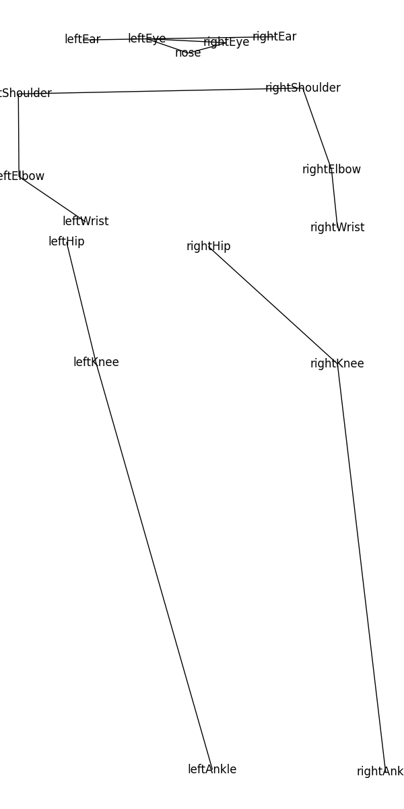
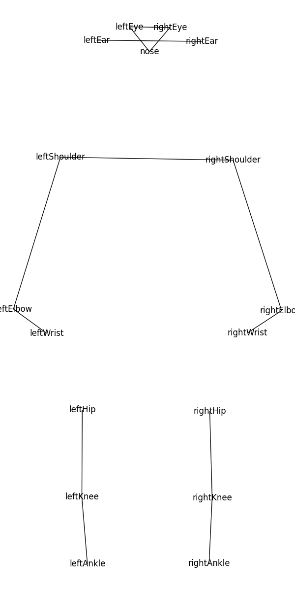

# Ted Talk Pose Analyzer 

## What does it do?
- Takes x no of youtube videos -> analyzes the poses of the speakers using posenet and stores the pose of each body part to a different file.
- I have implemented finding the max, min, mean body positions from the data, along with drawing the skeleton.
- Data: Collected from youtube and processed using ffmpeg. (Follow instructions below)

## How to use?
- Download posenet repository into this folder (all the files in this folder) from [here](https://github.com/rwightman/posenet-pytorch)
- Run analysis.py or open the notebook to understand whats happening

## Examples
- Max 

- Mean


## Create your own dataset
- Note : instructions will work on any unix based system like linux, mac. Tested on Arch linux.
- Get youtubedl, ffmpeg
- Find some playlist on youtube and download it using the following command.
- ```bash
youtube-dl -i --playlist-reverse --merge-output-format mp4 "link"
```
- Now we need to extract the video into frames. So create a folder called images in the same directory as where you downloaded the playlist and run this
- ```bash
for i in (ls *.mp4); ffmpeg -i $i -r 1/1 "./images/$filename%03d.png";end
```

## FAQ
- Your bash commands dont work
        - Follow them properly. And check your file paths
        - Dont use windows 
- Why.
        - Personal project
- Can I contribute?
        - YES! Addd your proposal as an issue :)
